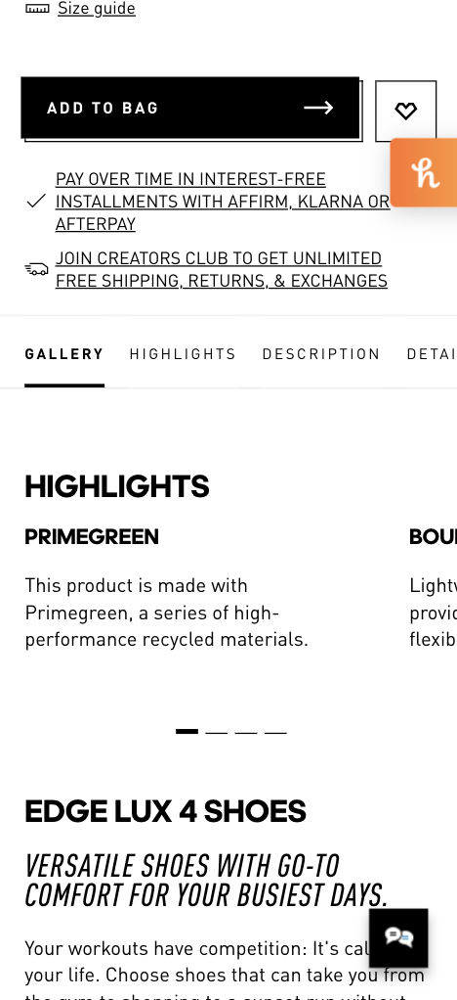
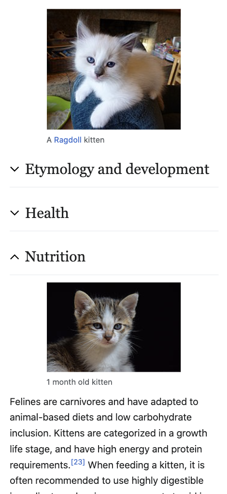
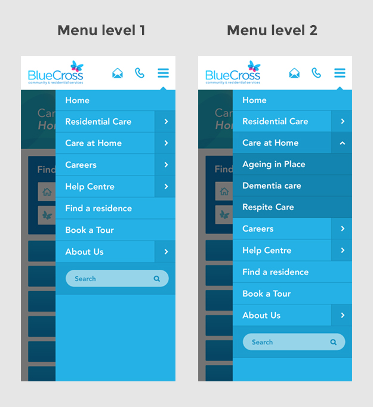

# Declarative Show-Hide Behavior

## Problem

In order to have interactive content today, you usually need to add script to
the page which handles events. This is how most popular tab components work.
However, using script introduces an unnecessary burden for developers who are
otherwise capable of implementing the visual design, and unless developers are
careful to add appropriate aria roles reduces the accessibility.

As the [research](https://open-ui.org/components/tabs.research.parts) shows the
UI design of tabs varies dramatically from site to site, so the goal here is to
provide the functionality of tabs while allowing the developer to apply styles
appropriate to their aesthetic.

## Goals

There are a large number of goals, which may not all be attainable with a single
ergonomic proposal:

* Toggle visibility of elements without using script*
* Can be styled based on current state
* Can be triggered by interactions with unrelated DOM nodes (i.e. no forced
    parent / sibling DOM structure)
* Embeddable (i.e. global labels not required)
* Accessible by default
* Anchors / scrolling to elements in other tabs auto-select that tab
* Selected tab preserved on navigations
* Gracefully falls back if new features are required
* Find in page can find content in other tabs
* Linkable (i.e. active tab can be shared)

## Use cases

### Tabs

The primary use case is to support tabs.



### Accordian

This could also support accordian style hide / reveal toggles.



### Tree view

A tree component could also be delivered without any script by nesting revealed
content areas.



## Possible solutions

### Input element pseudoclasses

It is possible to implement tabs today using the :checked pseudoclass on input
elements. See an example at
[http://youmightnotneedjs.com/#tabs](http://youmightnotneedjs.com/#tabs).

```html
<style>
[type=radio]:checked ~ label {
  /* Active tab style */
}

[type=radio]:checked ~ .content {
  /* Reveal active tab contents */
  display: block;
}

[type=radio] ~ .content {
  /* Hide inactive tab contents. */
  display: none;
}
</style>

<div class="tab">
  <input type="radio" name="tabgroup" id="tab1" checked>
  <label for="tab-1">Label One</label>
  <div class="content">
    <p>Tab One Content</p>
  </div>
</div>

<div class="tab">
  <input type="radio" name="tabgroup" id="tab2">
  <label for="tab-2">Label Two</label>
  <div class="content">
    <p>Tab Two Content</p>
  </div>
</div>
```

This is functional, technically accessible, can be navigated with the arrow keys
and preserves the selected tab if you navigate away and back. However, it has
several drawbacks.

1. Tab contents have to be sibling of input. This makes it complicated to
   achieve desired layouts. Labels also have to be a sibling of input to get
   active styling.
2. Requires a unique name for every tab and the group of tabs.
3. Pretends to be a radio element in accessibility tree. This could be
   confusing to accessibility users.
4. Content in other tabs is not searchable / linkable.
5. Selected tab is not linkable.

### Links to tab contents

Tabs could be built using links with
[hidden-matchable](https://github.com/whatwg/html/issues/6040), e.g.

```html
<style>
.tab-contents > div {
  /* Hide tab contents until they are targeted. */
  content-visibility: hidden-matchable;
}
</style>
<a href="#tab-content1">Label One</a>
<a href="#tab-content2">Label Two</a>
<div class="tab-contents">
  <div id="tab-content1">
    <p>Tab One Content</p>
  </div>
  <div id="tab-content2">
    <p>Tab Two Content</p>
  </div>
</div>
```

The main benefit of an approach like this is that it is inherently linkable,
supports find in page and linking to inner anchors. However, there are a
few challenges that would need to be resolved:

1. Need some way to style the currently targeted item.
2. Need to reveal the "default" tab if no other is targeted.
3. No direct correlation between link and revealed content.
4. Need a way to hide other tabs when switching to a new one.
5. Unclear if you could animate content into view.
6. Only activates on clicking.

### CSS Toggle States

The [CSS Toggle States](https://tabatkins.github.io/specs/css-toggle-states/)
proposal defines a way to introduce a toggleable state on arbitrary elements.

```html
<style>
.tab {
  toggle-states: 2 sticky;
  toggle-group: "tabgroup";
}
.tab[checked] {
  /* active tab style*/
}
#tab1 {
  toggle-share: #tab-content1
}
#tab2 {
  toggle-share: #tab-content2
}
.content {
  display: none;
}
.contents > div[checked] {
  display: block;
}
</style>
<div class="tabs">
  <div id="tab1" class="tab">Label One</div>
  <div id="tab2" class="tab">Label Two</div>
  <div id="tab-content1" class="content" checkable checked>
    <p>Tab One Content</p>
  </div>
  <div id="tab-content2" class="content" checkable>
    <p>Tab Two Content</p>
  </div>
</div>
```

The above nicely defines a toggleable state which determines which tab pane is
shown. There are however some challenges with this:

1. As with input elements, this requires unique names for each tab.
2. As with links, this likely only activates on clicking.
3. Content in other tabs is not searchable / linkable.
4. Selected tab is not linkable.
5. Unclear if we can preserve selected tab on navigation.

### New element types

We could define new element types which would directly add the set of expected
behaviors with an implicit hierarchy to avoid the need for unique identifiers.

```html
<tabs>
  <tab>Label One</tab>
  <tab>Label Two</tab>
  <content>Tab One Content</content>
  <content>Tab Two Content</content>
</tabs>
```

The above could implicitly match the first `<tab>` with the first `<content>`
that isn't itself within another content (i.e. supporting nesting). Such a
solution could solve most of the goals but misses on the linkability:

[Generic tabs](https://genericcomponents.netlify.app/generic-tabs/demo/index.html)
proposes intermixing tabs with content which allows it to nicely fall back to
sectioned content if not supported. e.g.

```html
<tabs>
  <h1>Label One</h1>
  <content>Tab One Content</content>
  <h1>Label Two</h1>
  <content>Tab Two Content</content>
</tabs>
```

Naively this does not allow wrapping the tabs with elements which could make
things like overflow or certain styles challenging.

1. No way to link to a particular tab.

## Open questions

The solutions section explores a variety of possible approaches to build the
functionality required for developers to develop components like those mentioned
in the use cases, however most of the solutions have one or more challenges.

The main open questions are:

* How could you preserve tab state across navigations?
* Should tabs be automatically linkable? If so, how? We could use [fragment
  directives](https://wicg.github.io/scroll-to-text-fragment/#the-fragment-directive)
  without breaking sites.
* Are there missing capabilities?
* Do we need a default style?
